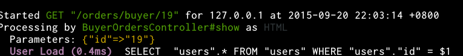
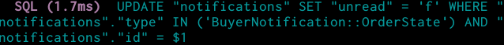
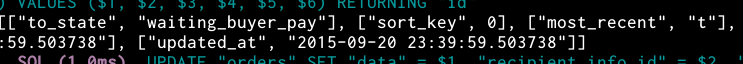
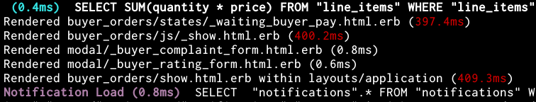

# RailsBetterLogger [](https://travis-ci.org/zw963/rails_better_logger) [](http://badge.fury.io/rb/rails_better_logger)

It just original rails logger, you don't miss anything, just better.

## Getting Started

Install via Rubygems

    $ gem install rails_better_logger

And then you could make this gem applied to all your's rails project
with just settings one environment variable in you $HOME startup script.

e.g. any of .bashrc/.profile/.bash_profie, setting this:

```sh
export $RUBYOPT=-rrails_better_logger
```

Or ...

Add to your project Gemfile

    group :development do
      gem 'rails_better_logger'
    end
    
## SnapShot

1. Highlight any request and controller action, with params.



2. Highlight `UPDATE/INSERT/DELETE` SQL query.



3. SQL query positional parameter always been print to a new line. 
   (make query and data seperate, more clearly)
   


4. Highlight slow rendered views. (great than 99 ms)
   


## Support

  * Rails 4+, should support Rails 3 too, issues welcome.

## Advise
  * Any advise is welcome, just make this gem better.

## TODO

  * Background highlight for any Exception.
  * Make color can be configure.
## Contributing

  * [Bug reports](https://github.com/zw963/rails_better_logger/issues)
  * [Source](https://github.com/zw963/rails_better_logger)
  * Patches:
    * Fork on Github.
    * Run `gem install --dev rails_better_logger` or `bundle`.
    * Create your feature branch: `git checkout -b my-new-feature`.
    * Commit your changes: `git commit -am 'Add some feature'`.
    * Push to the branch: `git push origin my-new-feature`.
    * Send a pull request :D.

## license

Released under the MIT license, See [LICENSE](https://github.com/zw963/rails_better_logger/blob/master/LICENSE) for details.
